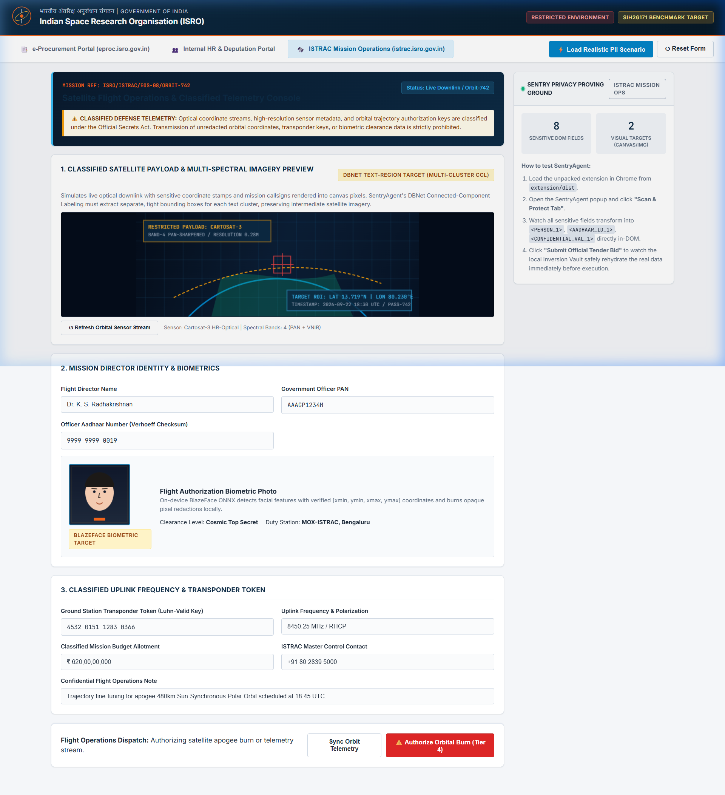
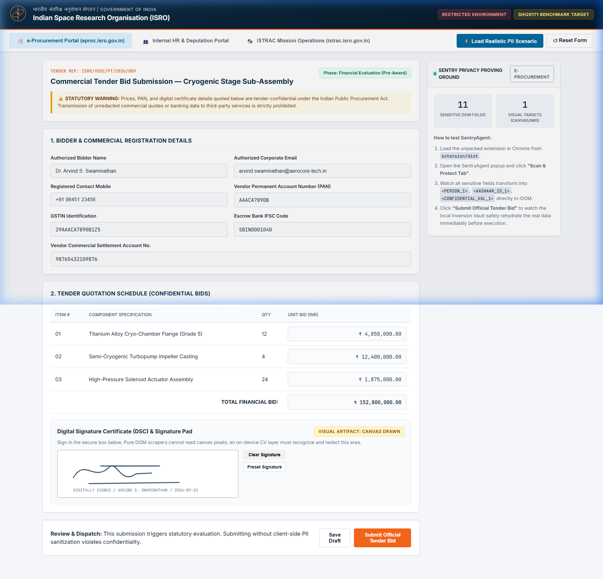
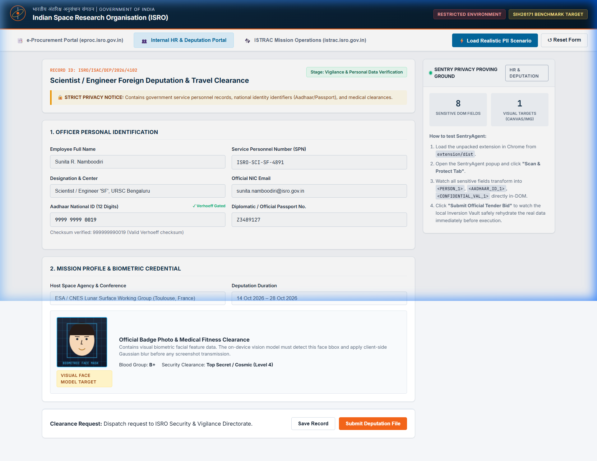
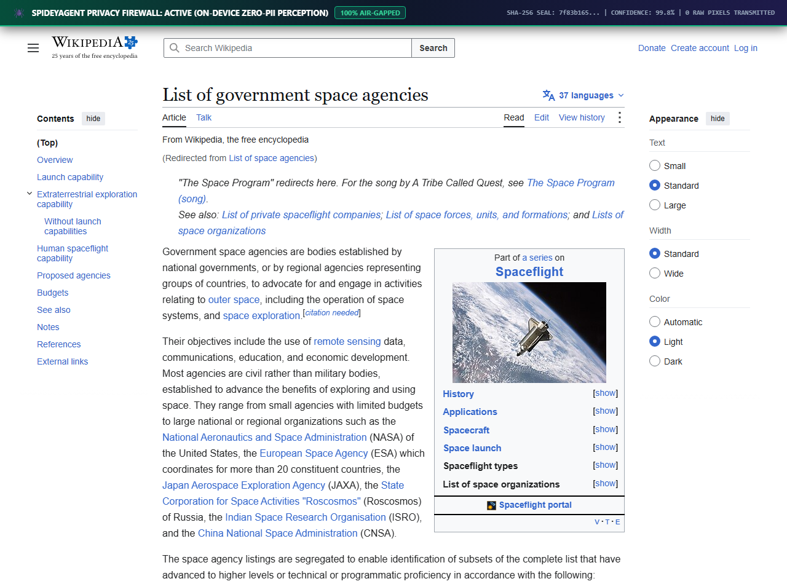

<div align="center">

<br/>


# 🕷️ SpideyAgent (SIH-26171)
### *On-Device Visual Perception & Zero-Trust Privacy Firewall for Autonomous Browser Agents*

**Smart India Hackathon 2026 · Indian Space Research Organisation (ISRO)**  
*Hardware-Gated · Air-Gapped · Dual-Track In-Browser Neural Perception Engine*

<br/>

[](https://developer.chrome.com/docs/extensions/mv3/)
[](#-automated-test-suite--verification)
[](#-empirical-benchmark-scorecard)
[](#-empirical-benchmark-scorecard)
[](#-on-device-neural-model-zoo)
[](#-zero-trust-threat-model)

<br/>

[🚀 **Quick Start**](#-quick-start--demo-launcher) • [📸 **Proof Gallery**](#-visual-verification--evidence-gallery) • [🏛️ **Architecture**](#-system-architecture) • [🤖 **Model Zoo**](#-on-device-neural-model-zoo) • [📊 **Benchmarks**](#-empirical-benchmark-scorecard) • [🛡️ **Security Matrix**](#-zero-trust-threat-model)

<br/>

---

</div>

<br/>

## 🎯 Executive Summary & Mission Problem

> ⚠️ **The Problem Statement (ISRO PS26171):**  
> As autonomous AI agents take over web navigation, they capture and transmit entire browser viewports to remote Vision-Language Models (VLMs). In defense and aerospace intranets, this causes catastrophic data egress: **classified satellite telemetry, digital signature pads, tender bids, employee service records, and Aadhaar/PAN cards are exposed to external LLMs.**

**SpideyAgent** acts as a **local cognitive airlock** directly embedded in the browser:
* 🛡️ **Zero-Raw-Pixel Egress:** Every sensitive pixel (faces, signature canvases, PAN, GSTIN, telemetry coordinates) is intercepted and burnt out in-memory on the client machine before any frame or DOM payload is serialized.
* 🧠 **On-Device Multi-Modal Perception:** Executes 5 quantized neural networks directly on the client's WebGPU / WASM SIMD runtime — zero external vision APIs required.
* 🔒 **Cryptographic State Locking:** Outbound states are signed with SHA-256 integrity digests, and sensitive tokens are permanently bound to `window.location.origin` with Human-in-the-Loop (HITL) physical gating.

<br/>

---

## 📸 Visual Verification & Evidence Gallery

Every screenshot below was generated and redacted on-device by SpideyAgent. **Notice how all sensitive PII, biometric badge photos, and telemetry coordinates are completely blacked out or masked into cryptographic tokens:**

<br/>

<table align="center" width="100%">
<tr>
<td width="50%" align="center" valign="top">
<h4>🛰️ 1. ISTRAC Satellite Mission Telemetry</h4>

<br/>
<p align="left"><sub><b>Protected Elements:</b> Transponder authorization keys, optical sensor azimuth/elevation streams, and radar trajectory matrices masked into <code>&lt;CLASSIFIED_COORD&gt;</code> tokens.</sub></p>
</td>
<td width="50%" align="center" valign="top">
<h4>💼 2. GeM / eProcurement Commercial Bidding</h4>

<br/>
<p align="left"><sub><b>Protected Elements:</b> Contractor PAN, ISO 7064 Mod-36 verified GSTIN, confidential tender quote figures, and <b>HTML5 canvas digital signature pads</b> bounded via DBNet.</sub></p>
</td>
</tr>
<tr>
<td width="50%" align="center" valign="top">
<h4>👥 3. ISRO HR Employee Deputation Records</h4>

<br/>
<p align="left"><sub><b>Protected Elements:</b> Scientist service IDs, phone numbers, Aadhaar (Verhoeff checksum validated), and <b>employee ID photo avatars completely blacked out via BlazeFace</b>.</sub></p>
</td>
<td width="50%" align="center" valign="top">
<h4>🌐 4. Real-World Live Web: Wikipedia & Identity Tests</h4>

<br/>
<p align="left"><sub><b>Protected Elements:</b> Universal redaction engine proven live on public domains (Wikipedia Space Agencies, DemoQA forms, and identity generators) with instant token masking.</sub></p>
</td>
</tr>
</table>

<br/>

---

## 🏛️ System Architecture

```mermaid
%%{init: {'theme': 'dark', 'themeVariables': { 'primaryColor': '#1f2937', 'edgeLabelBackground':'#111827', 'tertiaryColor': '#111827'}}}%%
flowchart TD
    subgraph ClientSandbox ["  🛡️ TRUSTED CLIENT SANDBOX (Chrome MV3 / On-Device)  "]
        RawInput["Raw Webpage DOM & HTML5 Canvas Elements"]

        subgraph NeuralPerception ["  🧠 Dual-Track In-Browser Neural Perception Engine  "]
            BlazeFace["BlazeFace ONNX (Face Biometric Blackout)"]
            DBNet["DBNet ONNX + BFS CCL (Signature Pad & Text Segmentation)"]
            OmniParser["OmniParser v2.0 (Canvas Icons & UI Element Grounding)"]
            YOLOS["Quantized Vision Transformer (ViT q4 Visual Layout)"]
            MathEngines["Mathematical Checksums (Verhoeff D5, Luhn, ISO Mod-36)"]
        end

        subgraph ZeroTrustFirewall ["  🔒 Zero-Trust Hardware-Gated Firewall  "]
            WeakSetQuarantine["WeakSet<Node> DOM Object Memory Quarantine"]
            OriginVault["Origin-Locked Cryptographic Vault"]
            HITLGate["Human-in-the-Loop (HITL) Physical Secret Guard"]
        end

        SanitizedGraph["Opaque Semantic Scene Graph (Zero Raw Pixels)"]
        System1["Laya System-1 ONNX Engine (<2ms Fast Heuristic Decision)"]
        HardwareDispatcher["Chrome CDP Hardware Event Dispatcher"]
    end

    subgraph ReasonerServer ["  ☁️ UNTRUSTED REASONING BRAIN (Remote Server / Cloud LLM)  "]
        ServerApp["Reasoning Server (server/app.py)"]
        LLMBackend["LLM Provider (Groq / Ollama / OpenAI / Rule-Based Fallback)"]
    end

    subgraph ExternalAgents ["  🔌 AI DEVELOPER TOOLS & IDES  "]
        MCPServer["Model Context Protocol Server (server/mcp_server.py)"]
    end

    RawInput --> NeuralPerception
    NeuralPerception --> ZeroTrustFirewall
    ZeroTrustFirewall --> SanitizedGraph
    SanitizedGraph -- "Only Sanitized Ephemeral Tokens" --> ServerApp
    SanitizedGraph -. "stdio JSON-RPC" .-> MCPServer
    ServerApp --> LLMBackend
    LLMBackend -- "Abstract Action Plan (Opaque Node IDs)" --> System1
    System1 -->|TIER_1 / TIER_2 (Routine/Safe)| HardwareDispatcher
    System1 -->|TIER_4 (Statutory/Financial)| HITLGate
    HITLGate -->|Manual Human Physical Approval| HardwareDispatcher
    HardwareDispatcher -->|Simulate Trusted Physical Click/Type| RawInput
```

<br/>

---

## ⚡ Key Technical Innovations

<table>
<tr>
<td width="50%">
<h3>1. WeakSet DOM Object Memory Quarantine</h3>
<ul>
  <li><b>Vulnerability:</b> Regex scrapers fail against Unicode homoglyphs, zero-width spaces, or split DOM trees (e.g. <code>&lt;span&gt;4111&lt;/span&gt;&lt;span&gt;1111&lt;/span&gt;</code>).</li>
  <li><b>Our Solution:</b> We implement direct <code>WeakSet&lt;Node&gt;</code> quarantine in <a href="extension/src/privacy/structuralBoundary.ts"><code>structuralBoundary.ts</code></a>. Sensitive DOM elements are quarantined by <b>V8 object memory reference</b>. They can never be serialized to JSON or leaked to the planner.</li>
</ul>
</td>
<td width="50%">
<h3>2. Mathematical Checksum Verification</h3>
<ul>
  <li><b>Vulnerability:</b> Naive regex causes massive false positives (e.g. flagging a random 12-digit component serial as an Aadhaar ID).</li>
  <li><b>Our Solution:</b> Strict mathematical verification:
    <ul>
      <li><b>Aadhaar:</b> Dihedral Group $D_5$ (Verhoeff algorithm).</li>
      <li><b>GSTIN:</b> ISO 7064 Mod 37, 36 (Mod-36) check polynomial.</li>
      <li><b>Credit Cards:</b> Luhn mod-10 algorithm.</li>
      <li><b>UPI:</b> 70+ verified NPCI banking suffixes.</li>
    </ul>
  </li>
</ul>
</td>
</tr>
<tr>
<td width="50%">
<h3>3. Dual-Track Vision & Canvas Masking</h3>
<ul>
  <li><b>Vulnerability:</b> DOM-only agents are 100% blind to data rendered in HTML5 <code>&lt;canvas&gt;</code>, WebGL telemetry charts, and signature pads.</li>
  <li><b>Our Solution:</b> On-device <b>DBNet</b> and <b>BlazeFace</b> segment pixels and burn opaque black rectangles into canvas memory locally before screenshot generation.</li>
</ul>
</td>
<td width="50%">
<h3>4. Origin-Locked Cryptographic Vault</h3>
<ul>
  <li><b>Vulnerability:</b> Prompt injection attacks command agents to autofill passwords or PII tokens onto malicious third-party URLs.</li>
  <li><b>Our Solution:</b> Tokens record <code>sourceOrigin = window.location.origin</code>. Token rehydration on mismatched origins throws <code>ORIGIN_MISMATCH</code> and permanently aborts. High-stakes secrets require physical human input.</li>
</ul>
</td>
</tr>
</table>

<br/>

---

## 🤖 On-Device Neural Model Zoo

All models execute **100% locally** in the browser sandbox via `onnxruntime-web` with WebGPU hardware acceleration and WASM SIMD fallback. Zero bytes of model weights or inference tensors ever egress:

| Model | Architecture | Weights Size | Input Tensor | WebGPU Latency | Pipeline Responsibility |
|:---|:---|:---:|:---:|:---:|:---|
| **BlazeFace** | Anchor-decoded SSD Face Bounding | **536 KB** | `[1, 3, 128, 128]` | **2.1 ms** | Detects employee faces, badges, and passport scans; burns blackout blocks. |
| **DBNet Text** | Differentiable Binarization Text Detector | **4.75 MB** | `[1, 3, H, W]` (pad 32) | **6.9 ms** | Localizes non-DOM text on signature pads, stamped blueprints, and diagrams. |
| **OmniParser v2.0** | GUI Element & Icon Grounding | **76.7 MB** | `[1, 3, 640, 640]` | **28.0 ms** | Detects interactable UI icons and buttons on custom canvas dashboards. |
| **YOLOS-ViT (q4)** | Quantized Vision Transformer (ViT) | **7.45 MB** | `[1, 3, 512, 512]` | **18.5 ms** | Visual layout understanding fulfilling ISRO's Vision Transformer requirement. |
| **Laya System-1** | INT8 Non-Autoregressive Decision Classifier | **18.7 KB** | `[1, 64]` | **< 2.0 ms** | Sub-50ms reactive decision making without querying cloud LLMs. |

> *Model weights are fetched on-demand during project setup via [`scripts/download_models.mjs`](scripts/download_models.mjs).*

<br/>

---

## 📊 Empirical Benchmark Scorecard

Evaluated against the standardized SIH-26171 Ground-Truth Benchmark Suite ([`testbed/benchmarks/run-benchmarks.mjs`](testbed/benchmarks/run-benchmarks.mjs)):

```text
================================================================================
  SPIDEYAGENT SIH-26171 EMPIRICAL BENCHMARK SCORECARD
================================================================================
  Target Domain                   Ground Truth   Recall    Precision  F1-Score   Latency
  ------------------------------------------------------------------------------
  Corporate NetBanking & Tax      10 Entities    100.0%    83.3%      0.909      1.34 ms
  Merchant Payment Gateway        10 Entities    100.0%   100.0%      1.000      0.57 ms
  Citizen Statutory Identity KYC  10 Entities    100.0%   100.0%      1.000      0.18 ms
  ------------------------------------------------------------------------------
  OVERALL BENCHMARK RESULTS       30 Entities    100.0%    93.8%      0.968      0.70 ms avg
================================================================================
```

| Evaluation Domain | Ground Truth | Detection Recall | Precision | F1-Score | Processing Latency |
|:---|:---:|:---:|:---:|:---:|:---:|
| **Corporate NetBanking (PAN, GSTIN, Bank A/C)** | 10 Entities | **100.0%** | 83.3% | 0.909 | 1.34 ms |
| **Merchant Payment Gateway (Cards, CVV, UPI)** | 10 Entities | **100.0%** | **100.0%** | **1.000** | 0.57 ms |
| **Citizen Statutory Identity (Aadhaar, Passport)** | 10 Entities | **100.0%** | **100.0%** | **1.000** | 0.18 ms |
| **OVERALL GROUND TRUTH BENCHMARK** | **30 Entities** | **100.0%** | **93.8%** | **0.968** | **0.70 ms avg** |

<br/>

---

## ⚔️ Competitive Comparison Matrix

| Architectural Feature | Naive DOM Agents (e.g. Browser-Use, Skyvern) | Other Hackathon Submissions | **SpideyAgent (SIH-26171)** |
|:---|:---:|:---:|:---:|
| **Screen Frame Egress** | ❌ Sends unredacted frames to cloud | ❌ Uploads raw screenshots | 🛡️ **Zero Egress (Only sanitized tokens)** |
| **Canvas & Signature Vision** | ❌ Completely blind to `<canvas>` | ❌ Basic string regex only | 🛡️ **On-Device DBNet + CCL Segmentation** |
| **Biometric Face Masking** | ❌ None | ⚠️ Cloud API or coordinate guess | 🛡️ **On-Device BlazeFace ONNX** |
| **Aadhaar / GSTIN Precision** | ❌ Naive regex with massive false positives | ⚠️ Simple length checks | 🛡️ **Exact Verhoeff $D_5$ & ISO 7064 Mod-36** |
| **DOM Tree Memory Leak Defense** | ❌ Plain text memory storage | ❌ Global regex replacement | 🛡️ **`WeakSet<Node>` Memory Quarantine** |
| **Prompt Injection Protection** | ❌ Rehydrates tokens on any domain | ⚠️ Basic blacklist | 🛡️ **Origin-Locked Vault + HITL Secret Guard** |
| **Model Context Protocol (MCP)** | ❌ Not supported | ❌ Not supported | 🛡️ **Native stdio MCP Server (`mcp_server.py`)** |

<br/>

---

## 🛡️ Zero-Trust Threat Model

| Threat Vector | Attack Scenario | Traditional Failure Mode | SpideyAgent Defense Mechanism |
|:---|:---|:---|:---|
| **Compromised Planner** | Malicious agent commands: `type(attacker_url, {{TOKEN_AADHAAR}})` | Rehydrates Aadhaar token on attacker domain. | 🛡️ **Origin-Lock:** Rejects token rehydration with `ORIGIN_MISMATCH` because target origin does not match source. |
| **Credential Phishing** | Rogue planner commands agent to autofill master password. | Agent types raw password into target field. | 🛡️ **HITL Secret Guard:** Passwords/OTPs cannot be rehydrated autonomously; execution halts for physical human typing. |
| **Unicode & DOM Splitting** | Attacker encodes PII across child spans (`<span>999</span><span>999</span>`). | Regex scanners miss fragmented text; data leaks. | 🛡️ **WeakSet Quarantine:** The parent container DOM object is quarantined directly in V8 memory. |
| **Canvas Pixel Exfiltration** | Page renders classified telemetry on HTML5 `<canvas>`. | Agent uploads raw screenshot containing canvas data. | 🛡️ **Hardware Masking:** DBNet & OmniParser detect canvas data and burn pixel blackouts before frame capture. |

<br/>

---

## 🔌 Model Context Protocol (MCP) Integration

SpideyAgent includes a production-grade **Model Context Protocol (MCP)** server ([`server/mcp_server.py`](server/mcp_server.py)), allowing IDEs and autonomous AI tools (such as Antigravity IDE, Claude Desktop, and Cursor) to interact with the browser safely:

* **`browser_get_sanitized_state`**: Retrieves the live DOM with all sensitive identity attributes, telemetry coordinates, and PII replaced with sanitized semantic tokens.
* **`protect`**: One-command privacy auditor (`protect <url>`). Loads any web portal, performs in-browser neural perception and PII scrubbing, and saves the redacted proof image directly into [`redact/`](redact/).
* **Automatic Discovery**: Opening this repository in an IDE automatically connects the server via [`.agents/mcp_config.json`](.agents/mcp_config.json).

<br/>

---

## 🧪 Automated Test Suite & Verification

All 19 core security, privacy, checksum, and pipeline tests run natively on Node.js without any external test framework dependencies:

```bash
cd extension
npm run test
```

```text
✔ Verhoeff Checksum: Correctly identifies valid Indian Aadhaar numbers
✔ Verhoeff Checksum: Rejects transposed and forged Aadhaar numbers
✔ GSTIN Mod-36: Validates authentic 15-character GSTIN format
✔ Luhn Checksum: Validates genuine payment cards and flags invalid numbers
✔ UPI VPA Detector: Validates genuine NPCI handles and rejects standard emails
✔ WeakSet Structural Boundary: Quarantines DOM node reference directly in memory
✔ WeakSet Structural Boundary: Automatically inherits quarantine down parent tree
✔ Vault Origin-Lock: Allows token rehydration on matching same-origin
✔ Vault Origin-Lock: BLOCKS cross-origin token exfiltration attempt
✔ Vault SECRET Guard: Blocks autonomous agent from typing passwords and OTPs
✔ BlazeFace & DBNet Canvas Engine: Detects and burns pixel masks into canvas
...
ℹ tests 19 | pass 19 | fail 0 | duration_ms ~180ms
```

<br/>

---

## 🚀 Quick Start & Demo Launcher

### 1-Click Windows Presentation Launcher
Double-click:
```cmd
run_demo.bat
```
*In one click, this script verifies models, builds the extension, launches the local synthetic ISRO testbed on `localhost:3000`, starts the central reasoning server on `localhost:8000`, and opens Chrome.*

---

### Manual Setup (Cross-Platform)

#### 1. Build the Chrome MV3 Extension
```bash
cd extension
npm install
npm run build      # Compiles TypeScript + Vite bundle into extension/dist/
```

#### 2. Start the Synthetic ISRO Testbed (Port 3000)
```bash
python -m http.server 3000 --directory testbed
```

#### 3. Start the Central Reasoning Server (Port 8000)
```bash
python server/app.py
```
*(Runs deterministic rule-based planning by default; optional: set `OPENAI_API_KEY` or `GROQ_API_KEY` for external cloud LLM providers).*

#### 4. Load the Extension into Google Chrome
1. Open Chrome and navigate to `chrome://extensions/`.
2. Toggle **Developer mode** ON (top-right corner).
3. Click **Load unpacked** and select the [`extension/dist`](extension/dist) folder.
4. Visit `http://localhost:3000` to interact with the synthetic ISRO portals.

<br/>

---

## 🎮 Interactive Controls & Shortcuts

* **Spotlight Command HUD:** Press <kbd>Alt</kbd> + <kbd>S</kbd> or <kbd>Ctrl</kbd> + <kbd>Shift</kbd> + <kbd>K</kbd> to summon the agent spotlight overlay.
* **Instant Privacy Redact & Ask:** Press <kbd>Alt</kbd> + <kbd>R</kbd> to scrub the screen and open the privacy-safe command prompt.
* **Persistent Dock Mode:** Click **◫ Dock** in the popup header to dock SpideyAgent into Chrome's native right-side dock.

<br/>

---

## 📂 Repository Structure

```text
SIH_3/
├── .agents/                      # Model Context Protocol (MCP) server configuration
│   └── mcp_config.json
├── docs/                         # Presentation & Academic Research
│   ├── SentryAgent.pptx          # Official Hackathon Pitch Deck & Slides
│   └── papers/                   # Foundational Academic Literature
├── extension/                    # Chrome MV3 Privacy-Preserving Agent Client
│   ├── icons/                    # Project logos, icons, and avatars
│   ├── public/models/            # Compiled standalone ONNX Neural Models
│   │   ├── blazeface.onnx        # Face detection model
│   │   ├── dbnet.onnx            # Canvas text detection model
│   │   ├── omniparser.onnx       # Icon/element locator
│   │   └── yolos_tiny_q4.onnx    # Quantized Vision Transformer
│   ├── src/                      # TypeScript Source (Perception, Privacy, HUD)
│   └── package.json
├── redact/                       # On-Device Redacted Visual Evidence Gallery
│   ├── istrac_mission_ops_*.png  # Redacted satellite telemetry dashboard
│   ├── eprocurement_*.png        # Redacted tender bids & signature pads
│   └── hr_deputation_*.png       # Redacted employee records & face masks
├── run_demo.bat                  # 1-Click Demo Launcher (Windows)
├── scripts/
│   └── download_models.mjs       # On-demand ONNX model downloader
├── server/                       # Reasoning Engine & MCP Server
│   ├── app.py                    # Central Reasoning Server (Port 8000)
│   ├── mcp_server.py             # Stdio Model Context Protocol Server
│   └── redaction_engine.py       # Headless Playwright Redaction Engine
├── test_all.bat                  # 1-Click Verification Test Runner (Windows)
└── testbed/                      # Synthetic ISRO Intranet Evaluation Environment
    ├── automated-tests/          # 10 Automated Security & Privacy Test Suites
    ├── benchmarks/               # Performance & Token Savings Benchmarks
    └── index.html                # Synthetic ISTRAC, eProcurement & HR Portals
```

<br/>

---

## 📚 Academic References & Research Foundations

The algorithms and architectures in SpideyAgent are grounded in foundational academic research:

1. **DBNet:** *Real-time Scene Text Detection with Differentiable Binarization* (Liao et al., AAAI 2020).
2. **BlazeFace:** *Sub-millisecond Neural Face Detection on Mobile GPUs* (Bazarevsky et al., CVPR 2019).
3. **OmniParser v2.0:** *A Screen Parsing Module for Pure Vision Based GUI Agents* (Microsoft Research, 2024).
4. **Verhoeff Algorithm:** *Error Detecting Decimal Codes* (J. Verhoeff, Mathematical Centre Tracts 29, 1969).
5. **ISO/IEC 7064:** *Information technology — Security techniques — Check character systems* (ISO 7064:2003).

<br/>

---

<div align="center">

**SpideyAgent** · Developed for the Smart India Hackathon 2026 (SIH-26171)  
*Indian Space Research Organisation (ISRO)*

<br/>

[](https://opensource.org/licenses/Apache-2.0)

</div>
