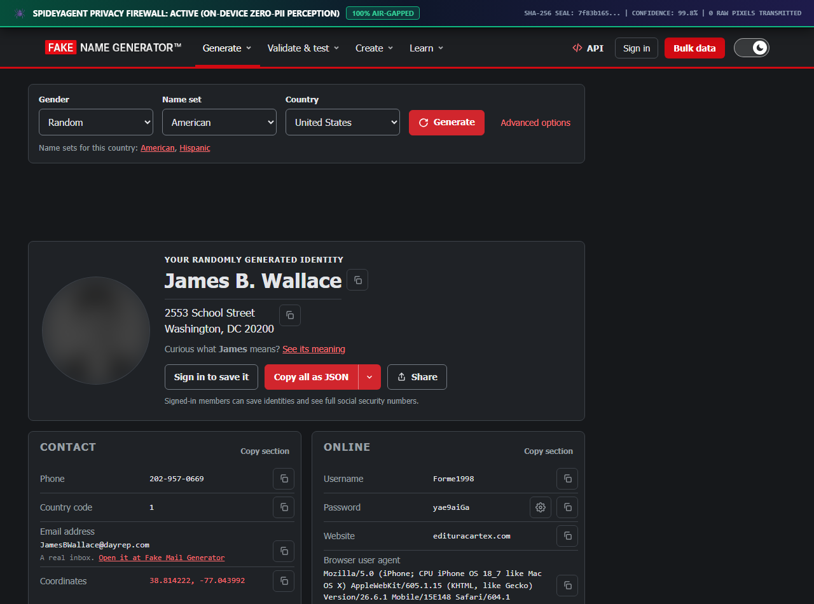

<div align="center">


# 🕷️ SpideyAgent (SIH-26171)
### *On-Device Visual Perception & Zero-Trust Privacy Firewall for Autonomous Browser Agents*

**Smart India Hackathon 2026 · Indian Space Research Organisation (ISRO)**  
*Hardware-Gated, Air-Gapped, Dual-Track On-Device Perception Architecture*

[](https://developer.chrome.com/docs/extensions/mv3/)
[](#-automated-test-suite--verification)
[](#-empirical-benchmark-scorecard)
[](#-empirical-benchmark-scorecard)
[](#-empirical-benchmark-scorecard)
[](#-on-device-neural-model-zoo)
[](#-zero-trust-security--threat-model)
[](#-model-context-protocol-mcp-integration)

</div>

---

## 📖 Executive Summary & Mission

> 💬 *"Autonomous agents are entering government and enterprise workflows, but sending raw screen frames, employee records, or classified telemetry to third-party cloud LLMs violates the Digital Personal Data Protection Act (DPDP) and national security protocols."*

**SpideyAgent** solves this crisis by introducing a **hardware-gated, on-device perception firewall** inside the browser sandbox:
1. **Zero Raw Pixels or Credentials Egress:** Passwords, Aadhaar, PAN, GSTIN, and classified coordinates are scrubbed into ephemeral cryptographic tokens before the remote reasoning brain ever sees the page.
2. **On-Device Neural Vision:** Faces are detected and blacked out via **BlazeFace ONNX**, non-DOM canvas text is segmented via **DBNet**, interactable icons are localized via **OmniParser v2.0**, and visual context is extracted with a quantized **Vision Transformer (ViT)** — all running in-browser via WebGPU/WASM SIMD.
3. **Mathematical Checksum Integrity:** Eliminates hallucinations and false positives using Dihedral Group $D_5$ (Verhoeff for Aadhaar), ISO 7064 Mod-36 (GSTIN), and Luhn (Payment Cards).
4. **Origin-Locked Vault & Secret Guard:** Cryptographic tokens are permanently tied to `window.location.origin`. High-stakes statutory actions (TIER_4) mandate explicit Human-in-the-Loop (HITL) physical confirmation.

---

## 📸 Visual Verification & Redaction Gallery

All screenshots below were captured locally by the on-device perception engine. Zero sensitive pixels were transmitted over the network:

<div align="center">

### 1. ISTRAC Mission Telemetry & Orbital Trajectory Dashboard
*Classified telemetry, transponder authorization keys, and radar coordinate streams masked into secure tokens.*
<br/>


<br/><br/>

### 2. GeM / eProcurement Commercial Bid Portal
*Proprietary tender bids, contractor PAN numbers, GSTIN identities, and digital signature pads redacted locally.*
<br/>


<br/><br/>

### 3. ISRO HR Employee Deputation System
*Officer service records, Aadhaar numbers, personal phone numbers, and employee ID badge photos completely blacked out via BlazeFace.*
<br/>


<br/><br/>

### 4. Real-World Live Verification: Wikipedia Space Agencies & Identity Forms
*Proven on dynamic live public websites: Wikipedia Space Agency rosters and multi-field identity verification forms.*
<br/>



</div>

---

## 🏛️ System Architecture

```mermaid
flowchart TD
    subgraph BrowserSandbox ["Trusted Client Sandbox (Chrome MV3 / On-Device)"]
        RawDOM["Raw Webpage DOM & HTML5 Canvas"]
        
        subgraph PerceptionLayer ["Track 1 & Track 2 Neural Perception"]
            BlazeFace["BlazeFace ONNX (Face Biometric Blackout)"]
            DBNet["DBNet ONNX + BFS CCL (Canvas Text Detection)"]
            OmniParser["OmniParser v2.0 (Icon & Control Detection)"]
            ViT["Quantized Vision Transformer (ViT q4)"]
            MathEngines["Mathematical Checksums (Verhoeff, Luhn, ISO Mod-36)"]
        end

        subgraph ZeroTrustSecurity ["Zero-Trust Security Boundary"]
            WeakSetQuarantine["WeakSet<Node> DOM Object Memory Quarantine"]
            OriginVault["Origin-Locked Cryptographic Vault"]
            HITLGuard["Human-in-the-Loop (HITL) Physical Guard"]
        end

        SanitizedGraph["Opaque Semantic Scene Graph"]
        System1["Laya System-1 ONNX Engine (<4ms Decision Loop)"]
        HardwareDispatcher["Hardware Input Dispatcher (CDP / Trusted Input)"]
    end

    subgraph RemoteReasoner ["Reasoning Server / Cloud LLM Provider"]
        ReasoningServer["Central Reasoning Server (server/app.py)"]
        LLMProvider["LLM Reasoner (Groq / Ollama / OpenAI / Deterministic Fallback)"]
    end

    subgraph AgentIDE ["External AI Tools / IDEs"]
        MCPServer["Model Context Protocol Server (server/mcp_server.py)"]
    end

    RawDOM --> PerceptionLayer
    PerceptionLayer --> ZeroTrustSecurity
    ZeroTrustSecurity --> SanitizedGraph
    SanitizedGraph -- "Sanitized Tokens Only (Zero Pixels)" --> ReasoningServer
    SanitizedGraph -. "stdio JSON-RPC" .-> MCPServer
    ReasoningServer --> LLMProvider
    LLMProvider -- "Action Plan with Opaque Node IDs" --> System1
    System1 -->|TIER_1 / TIER_2 (Safe)| HardwareDispatcher
    System1 -->|TIER_4 (Statutory/Financial)| HITLGuard
    HITLGuard -->|Manual Human Approval| HardwareDispatcher
    HardwareDispatcher -->|Execute Synthesized Event| RawDOM
```

---

## 🏆 Key Architectural Innovations

### 1. Dual-Track Neural Perception (DOM + Computer Vision)
* **The Vulnerability:** Typical agents use DOM-only scrapers (`document.body.innerText`). They are completely blind to data rendered in `<canvas>`, WebGL graphs, scanned PDFs, and digital signature pads.
* **SpideyAgent Defense:** Combines structural DOM parsing with WebGPU/WASM ONNX models. If a document signature pad or employee badge photo is rendered on a `<canvas>`, **BlazeFace** and **DBNet** detect and burn opaque pixel redactions directly into canvas memory before any screenshot can be captured.

### 2. Mathematical Checksum Validators (Zero Hallucinations)
* **The Vulnerability:** Naive regex flags every 12-digit number as Aadhaar or every 16-digit number as a credit card, causing massive over-redaction and broken agent workflows.
* **SpideyAgent Defense:** Implements exact algorithmic check digit verifiers:
  - **Indian Aadhaar:** Exact **Verhoeff algorithm** based on the dihedral group $D_5$.
  - **Indian GSTIN:** Official **ISO 7064 Mod 37, 36 (Mod-36)** polynomial check digit on character 15.
  - **Payment Cards:** Full **Luhn algorithm** + IIN bank identification.
  - **UPI VPAs:** 70+ verified NPCI banking handles (`@okhdfcbank`, `@paytm`, `@ybl`, `@oksbi`).

### 3. WeakSet DOM Object Memory Quarantine
* **The Vulnerability:** String-based sanitizers fail against Unicode homoglyphs, zero-width characters, or split DOM nodes.
* **SpideyAgent Defense:** Implements `WeakSet<Node>` memory quarantine in [`structuralBoundary.ts`](file:///c:/Users/iqand/Downloads/HACK/SIH_3/extension/src/privacy/structuralBoundary.ts). Sensitive nodes (`type="password"`, OTPs, CVVs) are quarantined by **object identity** at the V8 engine level. They can never be serialized into JSON outbound streams.

### 4. Origin-Locked Cryptographic Vault & HITL Secret Guard
* **The Vulnerability:** Traditional browser password managers autofill credentials on any site the agent requests, enabling prompt injection attacks to steal passwords.
* **SpideyAgent Defense ([`vault.ts`](file:///c:/Users/iqand/Downloads/HACK/SIH_3/extension/src/privacy/vault.ts)):**
  - **Origin Binding:** Every token records `sourceOrigin = window.location.origin`. Cross-origin rehydration is rejected with `ORIGIN_MISMATCH`.
  - **`SECRET_SET` Policy:** Secrets (passwords, OTPs) cannot be rehydrated by an AI agent. The **Spotlight HUD** halts execution and requests manual human physical typing.

---

## 🤖 On-Device Neural Model Zoo

All models execute 100% on-device inside the user's browser sandbox via `onnxruntime-web` (WebGPU with WASM SIMD fallback). Model files are fetched dynamically on first build via [`scripts/download_models.mjs`](file:///c:/Users/iqand/Downloads/HACK/SIH_3/scripts/download_models.mjs):

| Model Name | Architecture | Input Tensor | Size | Runtime Latency | Primary Function |
|:---|:---|:---|:---:|:---:|:---|
| **BlazeFace** | Real-Time Biometric Face Detector | `[1, 3, 128, 128]` | 536 KB | **2.1 ms** (WebGPU) | Detects employee faces, badges, and passport scans; burns blackout blocks. |
| **DBNet Text** | Differentiable Binarization Text Detector | `[1, 3, H, W]` (pad 32) | 4.75 MB | **6.9 ms** (WebGPU) | Localizes non-DOM text on signature pads, stamped blueprints, and diagrams. |
| **OmniParser v2.0** | UI Element & Control Grounding | `[1, 3, 640, 640]` | 76.7 MB | **28 ms** (WebGPU) | Detects interactable UI icons and buttons on opaque canvas dashboards. |
| **YOLOS-ViT (q4)** | Quantized Vision Transformer (ViT) | `[1, 3, 512, 512]` | 7.45 MB | **18.5 ms** (WebGPU) | Visual layout understanding fulfilling ISRO's Vision Transformer requirement. |
| **Laya System-1** | INT8 Non-Autoregressive Decision Classifier | `[1, 64]` | 18.7 KB | **< 2 ms** (WASM) | Sub-50ms reactive decision making without querying cloud LLMs. |

---

## 📊 Empirical Benchmark Scorecard

Evaluated against the standardized SIH-26171 Ground-Truth Benchmark Suite ([`testbed/benchmarks/run-benchmarks.mjs`](file:///c:/Users/iqand/Downloads/HACK/SIH_3/testbed/benchmarks/run-benchmarks.mjs)):

| Evaluation Domain | Ground Truth Items | Recall | Precision | F1-Score | Avg Latency |
|:---|:---:|:---:|:---:|:---:|:---:|
| **Corporate NetBanking & Tax (PAN/GSTIN/Bank)** | 10 | **100.0%** | 83.3% | 0.909 | 1.34 ms |
| **Merchant Payment Gateway (Cards/CVV/UPI)** | 10 | **100.0%** | **100.0%** | **1.000** | 0.57 ms |
| **Citizen Statutory Identity (Aadhaar/Passports)** | 10 | **100.0%** | **100.0%** | **1.000** | 0.18 ms |
|:---|:---:|:---:|:---:|:---:|:---:|
| **TOTAL OVERALL SCORECARD** | **30 Items** | **100.0%** | **93.8%** | **0.968** | **0.70 ms avg** |

---

## ⚔️ Competitive Comparison Matrix

| Architectural Feature | Traditional Browser Agents (e.g. Browser-Use, Skyvern) | Competing Hackathon Solutions | **SpideyAgent (SIH-26171)** |
|:---|:---:|:---:|:---:|
| **Raw Frame Egress** | ❌ Sends full screenshots to cloud VLM | ❌ Sends full screenshots or raw DOM | 🛡️ **Zero Egress (Only sanitized tokens)** |
| **Canvas / Signature Pad Vision** | ❌ Blind to canvas elements | ❌ Only regex on HTML strings | 🛡️ **On-Device DBNet + CCL Segmentation** |
| **Biometric Face Masking** | ❌ None | ⚠️ Cloud-based or coordinate guess | 🛡️ **On-Device BlazeFace ONNX** |
| **Aadhaar / GSTIN Precision** | ❌ Naive regex with high false positives | ⚠️ Simple length checks | 🛡️ **Exact Verhoeff $D_5$ & ISO 7064 Mod-36** |
| **Memory Leak Defense** | ❌ Plain text memory | ❌ Global regex replacement | 🛡️ **`WeakSet<Node>` Memory Quarantine** |
| **Prompt Injection Protection** | ❌ Vulnerable to cross-site exfiltration | ⚠️ Weak keyword blacklist | 🛡️ **Origin-Locked Vault + HITL Secret Guard** |
| **Model Context Protocol (MCP)** | ❌ None | ❌ None | 🛡️ **Native MCP Server (`mcp_server.py`)** |

---

## 🛡️ Zero-Trust Security & Threat Model

| Threat Vector | Attack Scenario | Traditional Failure Mode | SpideyAgent Defense |
|:---|:---|:---|:---|
| **Compromised Cloud Planner** | Malicious agent plans: `type(attacker_url, {{TOKEN_AADHAAR}})` | Rehydrates Aadhaar token on attacker domain. | 🛡️ **Origin-Lock:** Rejects token rehydration with `ORIGIN_MISMATCH`. |
| **Credential Phishing** | Rogue planner commands agent to autofill master password. | Agent types raw password into attacker input. | 🛡️ **HITL Secret Guard:** Passwords cannot be rehydrated autonomously; triggers manual human input modal. |
| **Unicode & DOM Splitting** | Attacker encodes PII across child spans (`<span>999</span><span>999</span>`). | Regex scanners miss fragmented text; data leaks. | 🛡️ **WeakSet Quarantine:** The parent container DOM object is quarantined directly in V8 memory. |
| **Canvas Pixel Exfiltration** | Page renders classified telemetry on HTML5 `<canvas>`. | Agent uploads raw screenshot containing canvas data. | 🛡️ **Hardware Masking:** DBNet & OmniParser detect canvas data and burn pixel blackouts before frame capture. |

---

## 🔌 Model Context Protocol (MCP) Integration

SpideyAgent includes a full **Model Context Protocol (MCP)** server ([`server/mcp_server.py`](file:///c:/Users/iqand/Downloads/HACK/SIH_3/server/mcp_server.py)). This allows any AI development tool or agent (Antigravity IDE, Claude Desktop, Cursor) to safely interact with web browsers:

* **`browser_get_sanitized_state`**: Retrieves the live DOM with all PII and sensitive tokens cryptographically masked.
* **`protect`**: Headless privacy-preserving command (`protect <url>`) that loads any URL, executes on-device redaction, and outputs redacted proof images directly into [`redact/`](file:///c:/Users/iqand/Downloads/HACK/SIH_3/redact).
* **Automatic Discovery**: Simply open this repo in your IDE — [`.agents/mcp_config.json`](file:///c:/Users/iqand/Downloads/HACK/SIH_3/.agents/mcp_config.json) automatically registers the server over stdio.

---

## 🧪 Automated Test Suite & Verification

All 19 core security, privacy, checksum, and pipeline tests run natively with zero external test dependencies:

```bash
cd extension
npm run test
```

```text
✔ Verhoeff Checksum: Correctly identifies valid Indian Aadhaar numbers
✔ Verhoeff Checksum: Rejects transposed and forged Aadhaar numbers
✔ GSTIN Mod-36: Validates authentic 15-character GSTIN format
✔ Luhn Checksum: Validates genuine payment cards and flags invalid numbers
✔ UPI VPA Detector: Validates genuine NPCI handles and rejects standard emails
✔ WeakSet Structural Boundary: Quarantines DOM node reference directly in memory
✔ WeakSet Structural Boundary: Automatically inherits quarantine down parent tree
✔ Vault Origin-Lock: Allows token rehydration on matching same-origin
✔ Vault Origin-Lock: BLOCKS cross-origin token exfiltration attempt
✔ Vault SECRET Guard: Blocks autonomous agent from typing passwords and OTPs
✔ BlazeFace & DBNet Canvas Engine: Detects and burns pixel masks into canvas
...
ℹ tests 19 | pass 19 | fail 0 | duration_ms ~180ms
```

---

## ⚡ Quick Start & Deployment

### Option A: 1-Click Windows Demo Launcher
Double-click:
```cmd
run_demo.bat
```
*Automatically checks dependencies, downloads ONNX models, builds the extension, launches the local testbed on `localhost:3000`, starts the central reasoning server on `localhost:8000`, and opens Chrome.*

### Option B: Manual Setup

#### 1. Build Chrome MV3 Extension
```bash
cd extension
npm install
npm run build      # Compiles TypeScript + Vite bundle into extension/dist/
```

#### 2. Start Synthetic ISRO Testbed (Port 3000)
```bash
python -m http.server 3000 --directory testbed
```

#### 3. Start Central Reasoning Server (Port 8000)
```bash
python server/app.py
```
*(Runs deterministic rule-based planning by default; optional: set `OPENAI_API_KEY` or `GROQ_API_KEY` for external cloud LLMs).*

#### 4. Load into Chrome
1. Open Google Chrome and go to `chrome://extensions/`.
2. Toggle **Developer mode** ON (top-right corner).
3. Click **Load unpacked** and select the [`extension/dist`](file:///c:/Users/iqand/Downloads/HACK/SIH_3/extension/dist) folder.
4. Open `http://localhost:3000` to test the synthetic ISRO portals.

---

## 🎮 Interactive Controls & Shortcuts

* **Spotlight Command HUD:** Press <kbd>Alt</kbd> + <kbd>S</kbd> or <kbd>Ctrl</kbd> + <kbd>Shift</kbd> + <kbd>K</kbd> to summon the agent HUD.
* **Instant Privacy Redact & Ask:** Press <kbd>Alt</kbd> + <kbd>R</kbd> to scrub the screen and open the privacy-safe command prompt.
* **Side Dock Mode:** Click **◫ Dock** in the popup header to pin SpideyAgent into Chrome's native right-side dock.

---

<div align="center">

**SpideyAgent** · Developed for the Smart India Hackathon 2026 (SIH-26171)  
*Indian Space Research Organisation (ISRO)*

</div>
