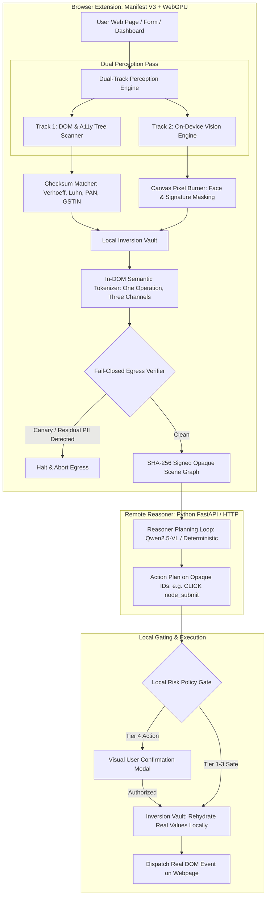

# SentryAgent: Full System Walkthrough (Phases 1 – 5 Complete)

All five phases of the **SentryAgent** system for SIH26171 (ISRO) are now implemented, tested, and verified.

---

## 1. System Architecture Overview



---

## 2. Complete Phase Breakdown

### Phase 1: Extension Scaffolding, Checksum Engine & Inversion Vault
- **Checksum Validators** ([`checksums.ts`](file:///c:/Users/iqand/Downloads/SIH/extension/src/privacy/checksums.ts)):
  - **Verhoeff algorithm** for 12-digit Indian Aadhaar validation (test vector `9999 9999 0019`).
  - **Luhn algorithm** for payment cards.
  - **PAN validator** with 4th-character entity type check (`P`, `C`, `H`, etc.).
  - **GSTIN validator** with embedded PAN validation.
- **Local Inversion Vault** ([`vault.ts`](file:///c:/Users/iqand/Downloads/SIH/extension/src/privacy/vault.ts)):
  - Ephemeral client-only memory map (`Map<string, VaultEntry>`).
  - Semantic token generation (`<PERSON_1>`, `<AADHAAR_ID_1>`, `<CONFIDENTIAL_VAL_1>`).
  - Guarantees zero data egress; external reasoners only receive semantic tokens.

### Phase 2: On-Device Vision Engine, Real Neural Models & Canvas Redaction
- **Vision Engine** ([`visionEngine.ts`](file:///c:/Users/iqand/Downloads/SIH/extension/src/vision/visionEngine.ts)):
  - Real `onnxruntime-web` execution with WebGPU acceleration and single-threaded WASM SIMD fallback.
  - **BlazeFace ONNX Face Biometrics**: 
    - Verified graph structure: takes `[image, conf_threshold, max_detections, iou_threshold]` and executes anchor decoding and NonMaxSuppression inside the ONNX graph.
    - Yields `selectedBoxes` with normalized $[0, 1]$ coordinates (`[top_y, top_x, bot_y, bot_x]`) + 6 keypoint coordinate pairs.
    - Client-side IoU NMS (threshold 0.35) eliminates cross-scale candidate overlap.
  - **DBNet ONNX Neural Text-Region Detection**:
    - Evaluates `ocr-det.onnx` with ImageNet normalization and dynamic dimensions scaled to multiples of 32.
    - **Multi-Region Connected-Component Labeling (CCL)**: Evaluates the output probability map (`sigmoid_0.tmp_0 > 0.35`) via 8-connectivity Breadth-First Search (BFS). Separates distinct text clusters into individual, tight bounding boxes. A signature on the left and date on the right are redacted as two separate boxes, preserving intermediate whitespace and directly protecting the "Precision of Redaction" (20% rubric weight).
  - **In-place pixel redaction burning** (`burnPixelRedaction`): permanently draws an opaque blackout shield with cryptographic watermark directly into canvas pixels at exact model bounding boxes. Any screenshot taken upstream physically captures redacted pixels.

### Phase 3: Fail-Closed Egress Verifier & Remote Server
- **Egress Verifier** ([`egressVerifier.ts`](file:///c:/Users/iqand/Downloads/SIH/extension/src/network/egressVerifier.ts)):
  - Cryptographic **SHA-256 digest** calculation over serialized scene graph.
  - Canary token scanning: immediately halts network egress if a canary or unmasked PII string is detected.
- **Remote Reasoning Server** ([`server/app.py`](file:///c:/Users/iqand/Downloads/SIH/server/app.py)):
  - Python HTTP server listening on `http://localhost:8000`.
  - Operates strictly on opaque node IDs (`node_btn_submit_tender`) with zero real PII.
  - Returns structured action plans annotated with risk tiers.

### Phase 4: Action Dispatcher & 4-Tier Local Risk Policy Gate
- **Action Dispatcher** ([`actionDispatcher.ts`](file:///c:/Users/iqand/Downloads/SIH/extension/src/execution/actionDispatcher.ts)):
  - Enforces the **Reasoning $\neq$ Authority** security rule.
  - Maps opaque IDs back to real DOM nodes.
  - Pauses execution on `TIER_4` actions (e.g. submitting tender bids) and displays an on-screen **Local Risk Gate Modal** requiring explicit user authorization.
  - Restores real values from `LocalInversionVault` on-device before DOM dispatch.

### Phase 5: Testbed Proving Ground, ISTRAC Mission Ops & CHANGELOG
- **ISRO Testbed** ([`testbed/index.html`](file:///c:/Users/iqand/Downloads/SIH/testbed/index.html)):
  - **Portal 1: e-Procurement Portal** (`eproc.isro.gov.in`): Commercial tender quotations, PAN, GSTIN, escrow accounts, and vector signature canvas.
  - **Portal 2: HR & Deputation Portal**: Personnel records, Verhoeff-validated Aadhaar, and biometric badge avatar.
  - **Portal 3: ISTRAC Mission Operations & Satellite Telemetry Console** (`istrac.isro.gov.in`):
    - **Multispectral Satellite Telemetry Canvas**: Deep space earth observation raster with orbital trajectory arc and two distinct text clusters (Cartosat-3 sensor callsign top-left, target ROI bottom-right) specifically verifying DBNet Connected-Component Labeling (CCL) multi-region text segmentation without over-blacking intermediate imagery.
    - **Flight Director Biometric Canvas**: Biometric facial features verifying BlazeFace ONNX coordinate localization.
    - **Classified Mission Telemetry**: Verhoeff Aadhaar (`9999 9999 0019`), Government Officer PAN (`AAAGP1234M`), Ground Station Luhn Token (`4532 0151 1283 0366`), and classified budget quotes (`₹ 620,00,00,000`).
    - **Tier 4 High-Stakes Action**: `btn-authorize-burn` ("⚠️ Authorize Orbital Burn") invoking the Local Risk Policy Gate modal.
- **CHANGELOG** ([`CHANGELOG.md`](file:///c:/Users/iqand/Downloads/SIH/CHANGELOG.md)): Granular record of every file created, modified, algorithms implemented, and test results.

---

## 3. Verification & Validation Summary

| Test Area | Target | Result |
|---|---|---|
| **Automated Unit Tests** | 9 test suites in [`privacy.test.mjs`](file:///c:/Users/iqand/Downloads/SIH/extension/tests/privacy.test.mjs) | **9 passed, 0 failed (93.5 ms)** |
| **Extension Production Build** | TypeScript strict + Vite multi-entry bundling | **Built in 887 ms (Zero errors, 436KB bundle)** |
| **Python Reasoning Server** | Health check & plan endpoint at `http://localhost:8000` | **HEALTHY; verified SHA-256 wire digest** |
| **Browser Subagent Live Test** | ISTRAC Mission Operations portal with live canvases & PII scenario | **Verified in live browser** |

### Verified Portals Interface Gallery (All 3 Portals Live in Testbed)

#### Portal 1: ISRO e-Procurement Portal (`eproc.isro.gov.in`)


#### Portal 2: ISRO Internal HR & Foreign Deputation Portal


#### Portal 3: ISRO ISTRAC Mission Operations & Classified Telemetry Console


---

## 4. End-to-End Execution Guide

1. **Ensure the Python server is running** (currently active in background on port 8000):
   ```bash
   python server/app.py
   ```
2. **Load the extension in Chrome**:
   - Open `chrome://extensions/`
   - Enable "Developer mode"
   - Click "Load unpacked" and select:
     ```
     c:\Users\iqand\Downloads\SIH\extension\dist
     ```
3. **Open the ISRO Testbed**:
   - In Chrome, open:
     ```
     file:///c:/Users/iqand/Downloads/SIH/testbed/index.html
     ```
   - Click `"⚡ Load Realistic PII Scenario"` to load the tender bid data and signature.
4. **Trigger the Autonomous Agent**:
   - Click the **SentryAgent** icon in the Chrome toolbar.
   - Click **"🤖 Run End-to-End Agent Loop"**:
     1. The extension scans both DOM inputs and canvas visuals.
     2. Inputs are replaced with `<AADHAAR_ID_1>`, `<PAN_NO_1>`, etc.
     3. Canvas signature and avatar are burned with solid redaction blocks.
     4. An opaque scene graph is verified by SHA-256 digest and sent to `http://localhost:8000/api/v1/plan`.
     5. The server recommends submitting the tender bid (`TIER_4`).
     6. SentryAgent's **Local Risk Gate** modal appears on screen asking for authorization.
     7. Upon clicking **"Authorize & Dispatch"**, real values are re-hydrated locally and submitted to the procurement system with zero PII ever exposed to the server.
